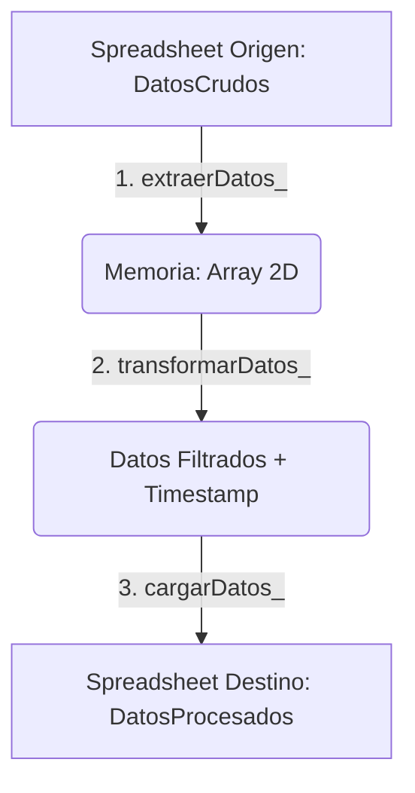

# Contexto del Proyecto: ETL-Básico (Google Apps Script)

Este documento maestro proporciona una auditoría técnica profunda y un análisis estático exhaustivo del proyecto **ETL-Básico**. Ha sido diseñado y estructurado por un Arquitecto de Software Principal e Ingeniero de Datos Senior como referencia técnica para contextualizar herramientas de IA y desarrolladores sobre el funcionamiento del sistema.

---

### 1. Visión General y Dominio del Proyecto

- **Objetivo Core:**  
  El sistema tiene un propósito educativo y de automatización ligera. Consiste en un pipeline de datos tipo **ETL (Extract, Transform, Load)** de una sola vía. Su objetivo principal es extraer registros tabulares de un archivo origen de Google Sheets (`DatosCrudos`), aplicar filtros de negocio específicos (registros que tengan un estado particular), enriquecer cada registro con metadatos temporales de auditoría, e inyectar el resultado limpio en un archivo destino de Google Sheets (`DatosProcesados`).

- **Casos de Uso Principales:**
  - **Orquestación Manual o Programada (Trigger):** El motor interno o un administrador ejecuta la función centralizadora `ejecutarETL()` de manera manual en la consola de Google Apps Script, o la vincula a un activador automático basado en tiempo (time-driven trigger).
  - **Consumo de Reportes:** Los usuarios de negocio consumen los datos procesados en la hoja de destino sin tener acceso a la hoja origen con los datos crudos o privados.

---

### 2. Matriz del Stack Tecnológico

| Capa | Tecnología / Herramienta | Propósito |
| :--- | :--- | :--- |
| **Presentación / Cliente** | Google Sheets | Interfaz de consumo visual para usuarios finales y almacenamiento de datos origen/destino. |
| **Lógica de Servidor / Aplicación** | Google Apps Script (V8 Engine) | Entorno de ejecución en la nube de Google basado en JavaScript (ES6+) para la automatización del flujo. |
| **Capa de Datos & Almacenamiento** | Google Sheets API (SpreadsheetApp) | API nativa de Google Apps Script utilizada como base de datos origen/destino sin ORM/ODM intermedio. |
| **Infraestructura & Herramientas** | CLASP (Command Line Apps Script Projects) | Herramienta CLI de Google para sincronización, versionado local/remoto y despliegue del script. |

---

### 3. Arquitectura del Sistema y Flujo de Datos

#### Patrón Arquitectónico
El sistema implementa una **Arquitectura de Tubería por Lotes (Batch Pipeline Monolítico)** con un diseño clásico de tres fases secuenciales síncronas: **Extract -> Transform -> Load**.



#### Comunicación e Integración
- **Interna:** El script se ejecuta directamente en la infraestructura serverless de Google Apps Script.
- **Externa:** Se integra con los servicios de Google Drive y Sheets a través de llamadas síncronas al servicio interno `SpreadsheetApp`, utilizando identificadores únicos globales (Spreadsheet IDs) pasados por parámetros.

#### Flujo de Datos (Data Flow)
1. **Punto de Entrada (Extract):** Se realiza una conexión síncrona a la hoja de cálculo especificada en `CONFIG.origen.spreadsheetId`. Se extrae el rango de datos completo (`getDataRange()`) en una matriz bidimensional nativa (`valores`).
2. **Procesamiento (Transform):** Los datos son cargados en memoria. Se separan los encabezados en la posición indicada por `CONFIG.origen.filaEncabezados` y se añade la columna `"Fecha de Procesamiento"`. Se itera la matriz descartando los registros cuyo valor en el índice configurado no coincida con el valor objetivo.
3. **Persistencia (Load):** Se abre el documento destino usando `CONFIG.destino.spreadsheetId`, se borra todo el contenido previo de la hoja destino usando `.clear()` y se realiza una escritura en bloque (`setValues()`) con la matriz final de datos procesados.

---

### 4. Lógica de Negocio Core y Reglas de Dominio

El código fuente en [`Código.js`](file:///d:/Desktop/Proyecto%20Ense%C3%B1anza/ETL-Basico/C%C3%B3digo.js) expone las siguientes reglas de negocio y patrones algorítmicos inferidos:

1. **Regla de Filtrado por Estado:**
   Solo se procesan aquellos registros de datos en los que el valor de la columna de estado (definida por el índice `CONFIG.transformacion.columnaEstadoIndex` = 2, equivalente a la columna C) sea exactamente igual al estado requerido (`CONFIG.transformacion.estadoRequerido` = `'Privado'`).
   
2. **Enriquecimiento Temporal (Auditoría de Procesamiento):**
   A cada registro que supera el filtro anterior se le añade un nuevo campo en la última posición con la fecha y hora exacta del procesamiento (`new Date()`). Los encabezados se expanden dinámicamente con la cabecera `"Fecha de Procesamiento"`.

3. **Carga Destructiva Síncrona (Idempotencia del Pipeline):**
   La capa de carga ejecuta una limpieza total de la hoja destino (`hojaDestino.clear()`) antes de realizar la inserción de los nuevos datos transformados. Esto asegura que no queden registros obsoletos de ejecuciones pasadas (idempotencia lógica), aunque destruye todo historial previo si no se cuenta con copias de seguridad.

4. **Operación de Escritura en Bloque (Bulk/Batch Write):**
   Para evitar cuotas y bloqueos por llamadas repetitivas a la API de Google, las dimensiones de la hoja destino se calculan programáticamente (`numFilas` y `numColumnas`). La inserción se realiza en una sola transacción síncrona de I/O mediante `rangoDestino.setValues(datos)`.

---

### 5. Topología del Repositorio

El espacio de trabajo consta de una estructura minimalista para proyectos de Google Apps Script:

```
ETL-Basico/
├── .clasp.json
├── appsscript.json
└── Código.js
```

#### Diccionario Estructural

- **`.clasp.json` (Archivo de Configuración de CLASP):**  
  Define la vinculación entre el repositorio local y el entorno de ejecución en la nube a través de la propiedad `scriptId`. Indica las extensiones permitidas para sincronización.
  
- **`appsscript.json` (Manifiesto del Proyecto):**  
  Establece metadatos clave para la ejecución del motor V8, como la zona horaria (`America/Argentina/Buenos_Aires`) y el nivel de logging de excepciones (`STACKDRIVER`).

- **`Código.js` (Script de Aplicación Principal):**  
  Centraliza toda la lógica de ejecución del ETL. Contiene la constante global de configuración `CONFIG` y las cuatro funciones del ciclo de vida del pipeline (`ejecutarETL`, `extraerDatos_`, `transformarDatos_`, y `cargarDatos_`). El uso de guiones bajos al final de los nombres de las funciones (`extraerDatos_`, etc.) indica al entorno de Google Apps Script que son funciones privadas no expuestas como macros o Web Apps.

---

### 6. Observaciones Técnicas y Calidad del Código

- **Cuellos de Botella y Rendimiento:**
  - **Límites de Tiempo de Ejecución (Quotas):** Google Apps Script impone un límite estricto de tiempo de ejecución (típicamente 6 minutos por ejecución). Si la hoja de cálculo origen tiene decenas de miles de filas, la lectura completa con `getValues()` y el filtrado por bucle secuencial lineal `for` bloquearán el hilo y superarán la cuota.
  - **Uso de Memoria:** Al cargar toda la matriz bidimensional de datos directamente en memoria, se corre el riesgo de desbordar la pila de Apps Script ante archivos origen extremadamente masivos.
  - **Baja Tolerancia a Fallos en Escritura (No Transaccional):** Al hacer `clear()` al destino antes del `setValues()`, si el script falla por cuotas o red entre ambas instrucciones, los datos procesados anteriores se perderán y la hoja destino quedará vacía.

- **Deuda Técnica y Calidad:**
  - **Hardcodeo de Configuración Sensible:** Los IDs de las hojas de cálculo se encuentran grabados en código duro dentro de `CONFIG`. Esto viola el estándar de separación de configuración y código. Se recomienda el uso de `PropertiesService.getScriptProperties()` para leer estos valores.
  - **Ausencia de Tipado y Validación:** Al ser JavaScript ES6 puro, no se valida si los datos del archivo origen cumplen con el formato de entrada, si la fila analizada tiene la longitud adecuada, o si la columna especificada en el índice existe, arriesgando fallos por `undefined`.
  - **Ausencia de Sanitización:** Los textos del origen no son sanitizados de espacios en blanco adicionales o inconsistencias tipográficas antes del filtrado estricto (`===`).

---

### 7. Instrucciones Obligatorias para la IA (System Guidelines)

> [!IMPORTANT]
> *"Siempre muéstrame el código actualizado y completo, indicándome los cambios realizados y/o modificados respecto a la versión anterior."*
